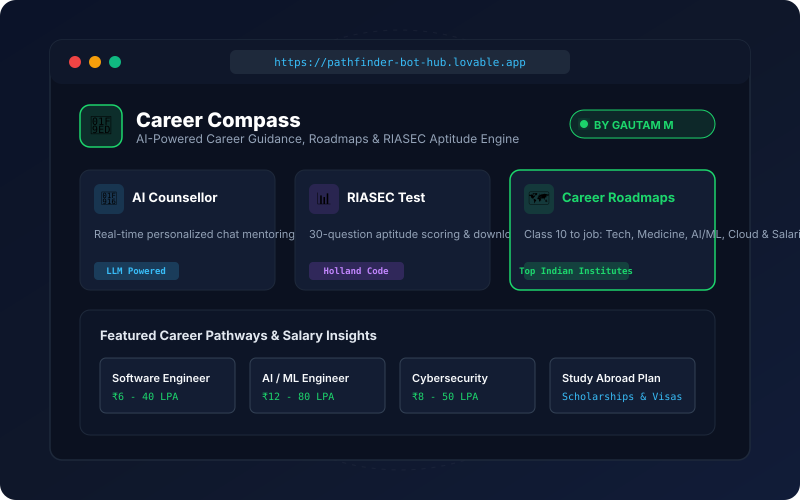

<div align="center">

# 🌌 Gautam M
### Software Developer • AI/ML Student • Universe & Cosmos Explorer

[](https://gautam-m567.github.io/portfolio/)
[](https://pathfinder-bot-hub.lovable.app/)
[](https://www.linkedin.com/in/gautam-m-046206318)
[](https://github.com/Gautam-M567)
[](mailto:www.gautu86@gmail.com)

<br/>

> *"Observing the cosmos with wonder, engineering software with logical precision."*

</div>

---

## 👨‍💻 About Me

I am an undergraduate **Computer Science & Engineering (AI & ML)** student at the **National Institute of Electronics & Information Technology (NIELIT) Calicut** (Class of 2026 – 2030).

* 🎓 **Education**: B.Tech CSE (AI & ML) at **NIELIT Calicut** (September 2026 — 2030)
* 🌌 **Personal Fascination**: Passionate about **researching the universe, the cosmos, astrophysics, and celestial mysteries**, bringing that same deep curiosity and philosophical perspective to problem-solving and software engineering.
* ⚡ **Core Foundations**: Low-level systems programming in **C++**, computational **Data Structures & Algorithms**, and discrete mathematics.
* 🤖 **Applied AI & Web**: Prompt engineering, vibe coding methodologies, and rapid deployment of full-stack AI platforms.
* 🛡️ **Cybersecurity**: Certified in **Ethical Hacking** through Offenso Hackers Academy; experienced in cryptographic hashing (SHA-256), defensive HTTP headers, and Linux environments.
* 💼 **Opportunities**: Open to technical internships, open-source collaborations, and developer opportunities.

---

## 🧭 Featured Flagship Project: Career Compass

<div align="center">

[](https://pathfinder-bot-hub.lovable.app/)

### [👉 Launch Live Web Application](https://pathfinder-bot-hub.lovable.app/) • [📂 View GitHub Repository](https://github.com/Gautam-M567/CAREER-COMPASS)

</div>

**Career Compass** is an end-to-end AI-powered career guidance platform designed and deployed by Gautam M, helping students discover personalized career paths from Class 10 to high-paying jobs.

### Key Capabilities:
* **30-Question RIASEC & Big-5 Aptitude Engine**: Calculates the user's Holland Personality Code and delivers personalized career fit recommendations with a downloadable report.
* **Step-by-Step Career Roadmaps**: Detailed milestones for Software Engineering (₹6–40 LPA), AI/ML Engineering (₹12–80 LPA), Cybersecurity (₹8–50 LPA), Cloud Architecture (₹15–60 LPA), and Medicine.
* **Top Indian Institutions Directory**: Curated guidance on leading colleges (NIELIT, IITs, NITs, IIITs) and admission requirements.
* **Global Study Abroad Strategy**: Country selection, examinations, financial breakdowns, and scholarship discovery.
* **Interactive AI Career Counsellor**: Real-time intelligent doubt-clearing and crisis contingency planning (*"What If I Fail?"*).

---

## 🛠️ Technical Skills & Tools

| Category | Technologies & Competencies |
|:---|:---|
| **Programming Languages** | C++ (STL, C++20), Python, JavaScript (ES6+), HTML5, CSS3, PHP, SQL |
| **Artificial Intelligence** | Prompt Engineering, Vibe Coding, LLM Integration, RIASEC Aptitude Systems |
| **Cybersecurity & Systems** | Ethical Hacking, Kali Linux, Web Crypto API (SHA-256), Security Headers (CSP, HSTS) |
| **Developer Tools** | Git, GitHub, VS Code, Linux Shell (Bash), Lovable |
| **Core Foundations** | Data Structures & Algorithms, Discrete Mathematics, Linear Algebra |

---

## 🏆 Industry Certifications

* 🛡️ **Introduction to Ethical Hacking** — *Offenso Hackers Academy* (`Issued: July 15, 2024`)  
  *Covers practical ethical hacking principles, network security fundamentals, and defensive cybersecurity concepts.*
* 🌐 **Introduction to Web Development** — *Offenso Tech School* (`Starter Program`)  
  *Covers modern web development standards, semantic markup, responsive design principles, and JavaScript.*

---

## 🎓 Academic Track

* **Bachelor of Technology — CSE (AI & ML)**  
  *National Institute of Electronics & Information Technology (NIELIT) • Calicut, Kerala*  
  `September 2026 — 2030 (Expected)`
* **Higher Secondary (12th Grade) — Computer Science**  
  *Rahmania HSS • Kozhikode, Kerala*  
  `June 2024 — March 2026`
* **High School**  
  *Chinmaya Vidyalaya*  
  `June 2011 — March 2024`

---

## 📁 Repository Structure

```text
portfolio/
├── index.html                  # Semantic, accessible HTML5 single-page application
├── css/
│   └── style.css               # Design system: Dark Slate (#121820), Neon Mint (#1cd66c), responsive layouts
├── js/
│   ├── projects-data.js        # Centralized dataset featuring Career Compass
│   ├── interactive-apps.js     # In-browser Career Compass interactive simulation engine
│   └── main.js                 # Typewriter headline, theme persistence, and modal controller
├── assets/
│   ├── gautam.jpg              # Gautam M personal portrait photograph
│   ├── avatar.svg              # Vector developer badge
│   └── project-career-compass.svg # Career Compass mockup illustration
├── robots.txt                  # Search engine crawler permissions
├── sitemap.xml                 # Search engine indexation map for Google Search Console
└── README.md                   # Repository showcase & credentials
